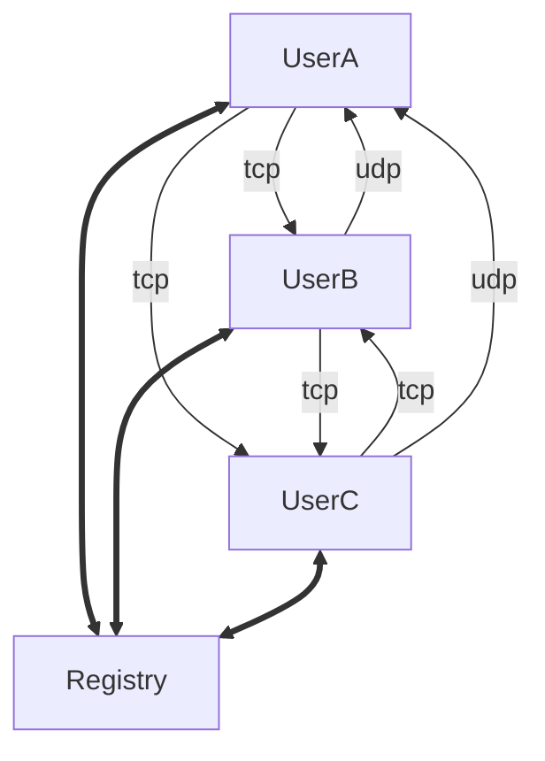
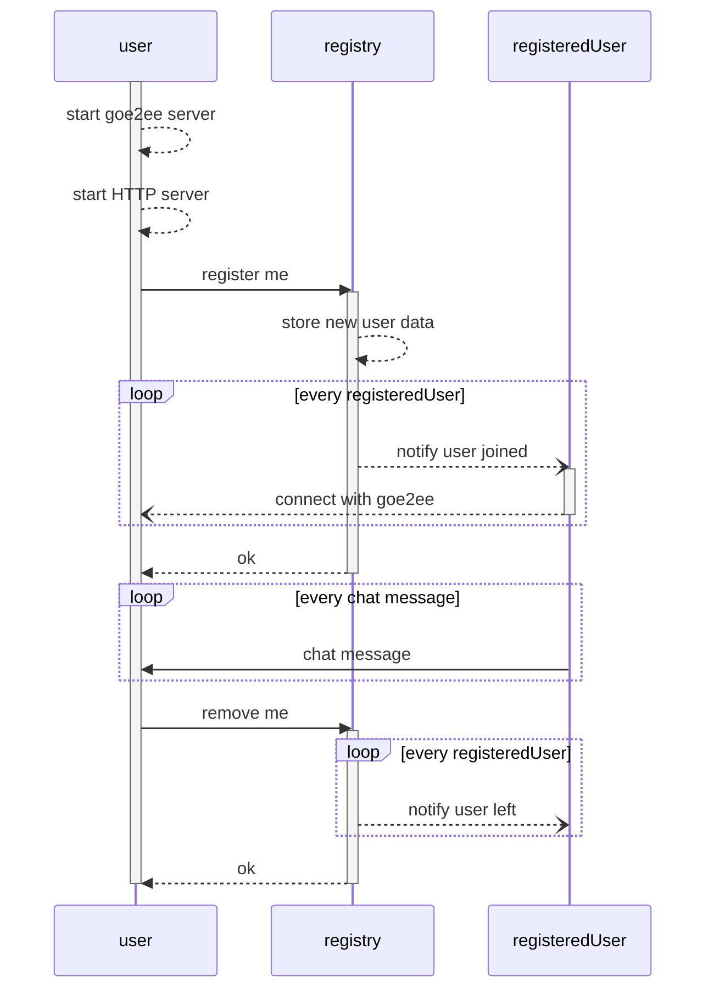

# Chat

When talking about end-to-end encryption a chat solution is something that
usually comes into discussion. For this reason, this example illustrates how a
chat application would work using goe2ee.



A central registry will be responsible for registering all users from the chat
room, and notifying their peers that some users joined or left the chat. That
means that each user will start a goe2ee and an HTTP server, where the HTTP
server will be used to receive notifications from the registry. Users can
connect using the goe2ee protocol via UDP or TCP (each user decides
independently).



The chat conversation will be automatically generated using the [Excuser
API](https://excuser-three.vercel.app/), randomly generating messages between 1
and 10 seconds. All messages are sent to all registered users, so it behaves
like a chat room/group. The client won't wait for a response from the server.

To execute this example you can first run the registry:
```shell
go run cmd/registry/main.go
```

That will print the registry address, then in other terminal tabs you can run as
many users as you would like:
```shell
go run cmd/user/main.go -name <name> -registry <registry-address> -network <network>
```

For example, running a TCP user:
```shell
go run cmd/user/main.go -name Rafael -registry localhost:62465 -network tcp
```
and a UDP user:
```shell
go run cmd/user/main.go -name James -registry localhost:62465 -network udp
```


