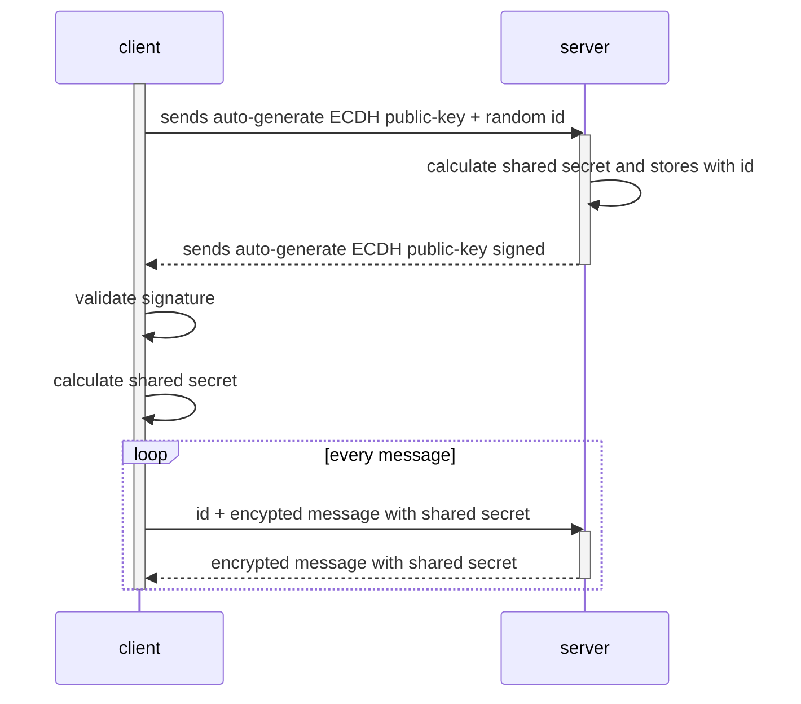
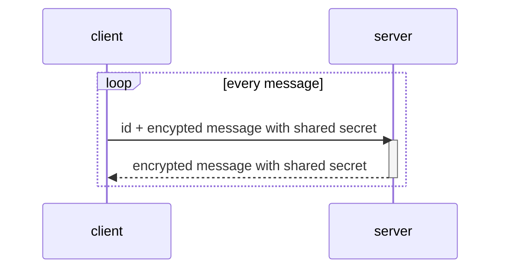

# Protocol

goe2ee protocol aims to give a similar security level to TLS 1.3, using
Diffie–Hellman key exchange, with some flexibility regarding sharing secrets
between multiple connections from the same host. The key sharing should save
handshakes, improving the initial performance.

For example, the full handshake can be described as:



While other clients from the same host could share the same secret and jump
directly to the encrypted message phase:



The protocol was also designed to work with both TCP and UDP protocols. For some
application scenarios where the data isn't big and a delivery guarantee is not a
requirement, the use of UDP could bring great performance benefits.

Finally, the protocol allows the client to retrieve the server public key using
many different strategies, throwing light on certification authority
alternatives, such as the DNSSEC chain of trust.

## Structure

All requests follow the pattern:

```
+------------------|-----------------|-------------------+
| version (4 bits) | action (4 bits) | message (n bytes) |
+------------------|-----------------|-------------------+
```

Where:
* `version` defines the protocol version. This is designed to allow up to 16
  versions of the protocol;
* `action` is an enumerate that tells the server what this request is about (4
  bits will allow up to 16 actions);
* `message` changes according to the `action`, it's optional.

The following actions are accepted:

| Action | Description |
| ------ | ------------|
| 0x1    | Hello       |
| 0x2    | Setup       |
| 0x3    | Process     |
| 0x4    | Fetch key   |

Having a version will allow evolving of the protocol as new approaches are
identified. This fixed header allows skipping the handshake stages if the shared
secret was already agreed upon previously because the client doesn't need to
follow a specific order of actions with the server. On the other hand, the
server needs to keep a state of the shared secrets associated with IDs even
after the client connection is closed. The technical approach for handling this
cache can be decided by the server implementation.

Once the request is processed correctly, all server responses will follow the
pattern:

```
+-----------------+-------------------+-------------------+
| success (1 bit) | reserved (7 bits) | message (n bytes) |
+-----------------+-------------------+-------------------+
```

Where:
* `success` is an enabled flag (1) to indicate success;
* `reserved` these flags are reserved for future use;
* `message` changes according to the request `action`, it's optional.

Otherwise, if the server rejected the request for any reason, the response will
follow the pattern below. Any request can return a failed response.

```
+-----------------+-------------------+----------------------+------------------------------+-------------------------+
| success (1 bit) | reserved (7 bits) | error-code (4 bytes) | error-message-size (8 bytes) | error-message (n bytes) |
+-----------------+-------------------+----------------------+------------------------------+-------------------------+
```

Where:
* `success` is a disabled flag (0) to indicate failure;
* `error-code` identifies the type of error that happened;
* `error-message-size` defines the error message size. The maximum message size
  is an unsigned 64-bit number;
* `error-message` will contain details of the error, it's optional.

The following error codes are accepted:

| Error Code | Description         |
| ---------- | ------------------- |
| 0x01       | Malformed request   |
| 0x02       | Server error        |
| 0x03       | Unknown client      |
| 0x04       | Unsupported version |

The structure of each action can be found in the following sections.

### Hello (action 0x1)

Used to check if the connection with the server is still valid. It's the most
basic mechanism of the protocol.

**Request:**
```
+------|------+
| 0001 | 0001 |
+------+------+
```

**Response:**
```
+---+-------------------+
| 1 | reserved (7 bits) |
+---+-------------------+
```

### Setup (action 0x2)

This is the main action of the protocol, where the client and server exchange
public keys so a new shared secret can be generated. The use of the
Diffie–Hellman key exchange guarantees that the shared secret will never be
carried over the network, increasing security.

At this stage, the client also provides an identifier to be associated with the
shared secret. This identifier will be used on the server side to correctly
select the client-shared secret to decrypt the message. It MUST be unique per
host.

**Request:**
```
+------+------+---------------+---------------------------+----------------------+
| 0001 | 0010 | id (16 bytes) | public-key-size (4 bytes) | public-key (n bytes) |
+------+------+---------------+---------------------------+----------------------+
```

Where:
* `id` is a client-unique identifier for the secret following RFC 4122. A client
  could have multiple connections with the same server, each one with a
  different secret, so an identifier is required to uniquely identify each
  client instance. This should also cover scenarios where there're network boxes
  between the client and server, such as proxies.
* `public-key` is encoded in PKIX, ASN.1 DER form. The encoded public key is a
  SubjectPublicKeyInfo structure (see RFC 5280, Section 4.1). This is the ECDH
  key generated by the client on-the-fly.

**Response:**
```
+---+-------------------+---------------------------+----------------------+--------------------+--------------------------+---------------------+
| 1 | reserved (7 bits) | public-key-size (4 bytes) | public-key (n bytes) | hash-type (1 byte) | signature-size (8 bytes) | signature (n bytes) |
+---+-------------------+---------------------------+----------------------+--------------------+--------------------------+---------------------+
```

* `public-key` is encoded in PKIX, ASN.1 DER form. The encoded public key is a
  SubjectPublicKeyInfo structure (see RFC 5280, Section 4.1). This is the ECDH
  key generated by the server on-the-fly.
* `hash-type` is the hash type used when generating the signature.
* `signature` is the message signed with the server's global-key. The client
  should retrieve the server's public key somehow before the handshake.

The following hash types are accepted:

| Type | Description |
| ---- | ----------- |
| 0x1  | SHA-1       |
| 0x2  | SHA-256     |
| 0x3  | SHA-384     |
| 0x4  | SHA-512     |

The signature algorithm can follow the steps below.

1. The server hashes the initial part of the message;
```
+---+-------------------+---------------------------+----------------------+
| 1 | reserved (7 bits) | public-key-size (4 bytes) | public-key (n bytes) |
+---+-------------------+---------------------------+----------------------+
```
2. Using the server's private global-key, signs the hashed content and generates
   a signature;
3. The server attaches to the hash type and the signature to the response;
4. The client hashes the same part of the message using the provided hash type;
5. Finally, the client validates the hashed content using the server's public
   global-key.

### Process (action 0x3)

After all the handshake phase is done, is time to exchange encrypted messages
using the shared secret. The client encrypts the message with the shared secret
and sends the related identifier with the encrypted content. The response also
contains the message encrypted with the same shared secret from the request.

**Request:**
```
+------+------+---------------------+-------------------------+---------------+----------------------------------+-----------------------------+
| 0001 | 0011 | expectReply (1 bit) | reserved-flags (7 bits) | id (16 bytes) | encrypted-message-size (8 bytes) | encrypted-message (n bytes) |
+------+------+---------------------+-------------------------+---------------+----------------------------------+-----------------------------+
```

Where:
* `expectedReply` allows the client to inform the server that it doesn't expect
  a response. A typical fire-and-forget request.
* `reserved-flags` are flags reserved for future use.
* `id` identifies the client when sending encrypted messages. The identifier is
  generated by the client during the setup process and can be shared for
  requests from the same host.
* `encrypted-message` is the payload encrypted with the shared secret associated
  with the provided identifier.

**Response:**
```
+---+-------------------+----------------------------------+-----------------------------+
| 1 | reserved (7 bits) | encrypted-message-size (8 bytes) | encrypted-message (n bytes) |
+---+-------------------+----------------------------------+-----------------------------+
```

### Fetch key (action 0x4)

This is an alternative approach for the client to retrieve the server's public
global-key. It's not recommended as it can be vulnerable to man-in-the-middle
attacks.

**Request:**
```
+------+------+
| 0001 | 0100 |
+------+------+
```

**Response:**
```
+---+-------------------+------------------------+---------------------------+----------------------+
| 1 | reserved (7 bits) | key-algorithm (1 byte) | public-key-size (4 bytes) | public-key (n bytes) |
+---+-------------------+------------------------+---------------------------+----------------------+
```

Where:
* `key-algorithm` stores the format for parsing the public key.
* `public-key` is the public global-key of the server.

The following algorithms are accepted:

| Algorithm | Description |
| --------- | ----------- |
| 0x1       | RSA         |
| 0x2       | Ecdsa       |
| 0x3       | Ed25519     |